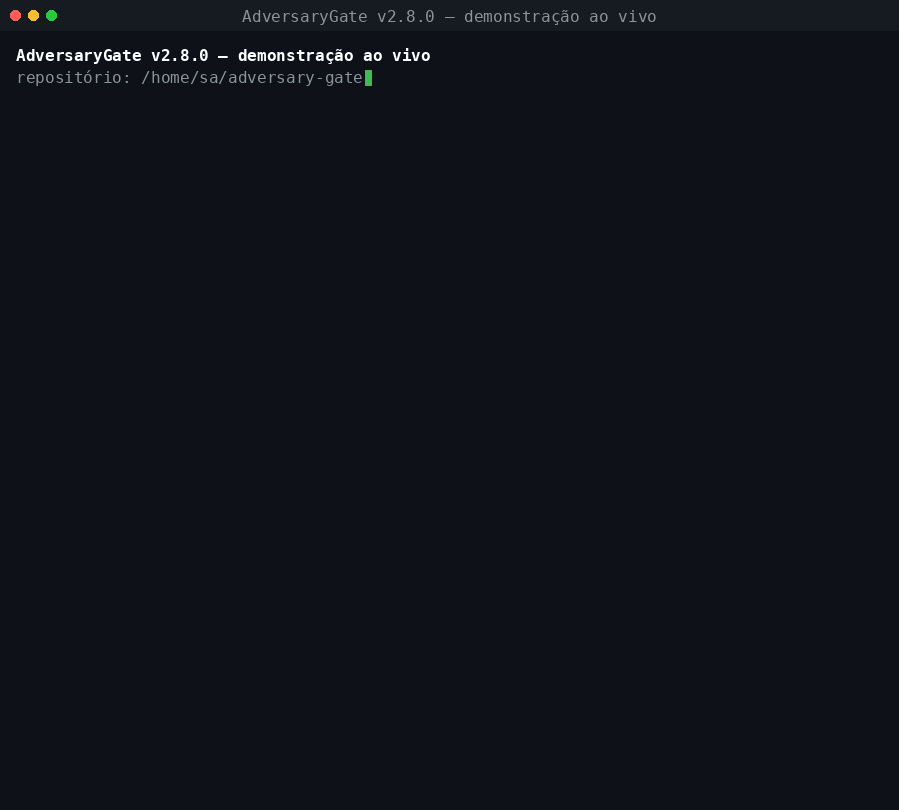

# AdversaryGate (v2.8.0)

> **High AI usage ≠ high confidence.** The cost of an agentic coding pipeline is
> not the model's intelligence — it is the pipeline's self-deception.

> **Uso alto de IA ≠ confiança alta.** O custo de um pipeline com agentes de
> código não está na inteligência do modelo, está no autoengano do pipeline.

An evidence-based fail-closed verification gate for AI coding agents where **uncertainty is a first-class result (`INCONCLUSIVE`)** instead of a silent approval.

**Measures Python/pytest repositories today.** On other stacks it runs your suite via `--test-command` but answers `INCONCLUSIVE`, never `MERGE` — see [Language support](#-language-support--read-this-if-your-repo-is-not-python).

```bash
pip install adversary-gate
```

| Document | What it is |
| --- | --- |
| 📄 **[CHANGELOG](CHANGELOG.md)** | what changed — and which versions actually have a tag |
| 🛡️ **[SECURITY](SECURITY.md)** | report a fail-open. A bug in this repo *is* a security bug, because a wrong `MERGE` is the whole failure mode |
| 📋 **[Findings AG-001…AG-032](ERRORS_AND_INCONSISTENCIES.md)** | every finding, reproduced by real exit code before being fixed — and what is still open |

---

## 🎬 Watch it decide (60 seconds)



**B and C are the same patch.** Same code, same tests, same execution. The only difference is that C brought evidence (`--diff` + `--coverage-json`); B brought none.

| | Patch | Coverage evidence | Decision | Exit |
|---|---|---|---|---|
| **A** | breaks the test | declared `untrusted` | `BLOCK` | 1 |
| **B** | clean | none — never measured | `INCONCLUSIVE` | 2 |
| **C** | clean | measured, both artefacts SHA-256'd | `MERGE` | 0 |

That middle row is the whole product. An unproduced measurement is not a measurement, so it cannot clear a floor — and a number nobody can re-derive is an opinion with a false precision label.

```bash
python3 demo/demo.py          # runs the three scenarios; exits non-zero if one regresses
python3 demo/render_gif.py    # rebuilds demo/demo.gif from the captured frames
```

`demo/demo.py` is an **acceptance test**, not a screenshot: it builds the fixtures, runs the real CLI as a subprocess, reads the real exit codes, and fails if any of the three decisions changes. Its evidence artefacts are checked in under `demo/out/`.

> **`INCONCLUSIVE` is not an error.** It is the gate saying *"I did not measure that"*, and it is exit 2 so CI treats it as "do not merge yet", not as "pass". See [How `diff_coverage` gets its value](#how-diff_coverage-gets-its-value) for the one-step path from `INCONCLUSIVE` to `MERGE`.

---

## 🎯 The Thesis

1. **High AI usage ≠ high confidence.** The more a team leans on agents in its real engineering flow, the more the cost of *"looks right"* shows. Agents write fluent, plausible code, and naive pipelines that collapse infrastructure errors into "pass" approve patches whose tests are broken or never ran.
2. **Switching models is a symptom.** Teams move between models looking for PRs they can trust. What is missing is **deterministic verification, not a better model**. AdversaryGate runs the same test harness with no LLM in the verifier, which is what makes patches from different models comparable at all.
3. **The loss is concrete.** Merged regressions, tasks reported done that are not, rollbacks, and reviewer hours spent re-reading the same PR.
4. **Less pipeline self-deception.** The product does not sell a smarter AI. It sells a pipeline that says *"I did not measure that"* instead of a green check. How to count that honestly is in [Provenance & metrics](#-provenance--metrics) — and the counter this README used to point at is zero by construction on the gate's own logs (AG-029), so it is no longer the pitch.

---

## 🔒 The Fail-Closed Model & Double-Filter Rigor

A single invariant governs the entire system:
> *The gate only reports what a healthy test harness actually executed. Unproduced proof is never proof of clean code.*

| State | Outcome | Meaning |
|---|---|---|
| `Executed & Passed` | `Outcome.VERIFIED` | Test ran to completion and evidence confirms clean execution. |
| `Executed & Failed` | `Outcome.REFUTED` | Test ran to completion and evidence condemns the patch. |
| `Harness / Error` | `Outcome.UNVERIFIED` | Collection error, syntax error, missing file, timeout or flaky signal. **Never mergeable.** |

### Patch Decision Matrix

- **`Decision.MERGE`**: Requires **every** verdict to be `VERIFIED`, a **measured** `diff_coverage >= 80%`, a suite strength whose **80 % lower confidence bound** is `>= 0.75` when strength was measurable (`suite_strength_lower`), and the full repository test suite to pass on the patch side.
- **`Decision.BLOCK`**: Triggered if any claim is `REFUTED`, or if the patch fails the full test suite **that the baseline passed** (*collateral regression*). Checked **before** the coverage floor: direct evidence of breakage outranks missing evidence.
- **`Decision.INCONCLUSIVE`**: Triggered on `UNVERIFIED` outcomes, open circuit breakers, **coverage that was never measured**, a weak test suite (`suite_strength < 0.75`), a strength that could not be measured even though source changed, or a full suite that was already red before the patch. **Never merges.**

Precedence is `BLOCK` > `INCONCLUSIVE` > `MERGE`, and direct evidence always outranks missing evidence: a patch whose claim could not be executed but whose collateral run broke the suite is `BLOCK`, not a shrug.

**A passing claim says *how* it passed (AG-030).** `VERIFIED` comes with one of three classifications: `fixed` — the test **failed on the baseline and passes on the patch**, the strongest evidence there is that the patch fixes what the test checks (SWE-bench's *FAIL_TO_PASS*); `no_regression` — it passed on both sides, which only says nothing it checks broke; `discarded` — a test the patch added, with no "before". The output carries `claims_fixed` and `fix_proven`, so *"this patch fixes what it says it fixes"* is a field, not an inference — and `MERGE` with `fix_proven: false` is a patch that broke nothing and proved nothing about the bug it was for.

**The patch does not get to write its own answer — the baseline does.** If the claim's test file already existed on the baseline and its bytes differ on the patch, the patch's copy is never run for the verdict. The gate copies the patch tree, puts the **baseline's** test file back, and runs the claim there: the patch's code answers to the test that existed before it (the *baseline oracle*; the artefact records `"oracle": "baseline"`). So a bug hidden behind a rewritten assertion is `REFUTED` → `BLOCK`, and an honest refactor of the test file is `VERIFIED` instead of stuck. A test the patch *added to an existing file* has no baseline copy: it is judged like any added test, but only after **every test the baseline shipped in that file** has passed on the patch's code (`"oracle": "baseline-file"`) — so the new test cannot be the cover for an old one the patch bent. The oracle covers three more places a test's answer can hide:

- **Helpers.** Every baseline file that is a test file is put back, not only the claim's — `test_*`, `*_test.py`, `conftest.py`, anything under `tests/` or `__tests__/`, and `*.test.*`, `*.spec.*`, `*_test.go`, `*Test.java`, `*_spec.rb`. A helper whose path says nothing (`testing_utils.py` at the root) cannot be told apart from code under test — `numpy.testing` is public API — so it is **declared**: `--test-support testing_utils.py` (repeatable, a glob; Action input `test-support`). Declared paths are test files everywhere: out of diff coverage and mutation, and restored from the baseline. Any change to a baseline test file engages the oracle, even with the claim's own file untouched.
- **The collateral suite.** When the patch changed tests the baseline had, the full-suite run also executes the **baseline's** tests against the patch's code (`full_suite_oracle` in the artefact). A test that is no claim's, bent to agree with a bug, is a collateral regression → `BLOCK`.
- **`--test-command` claims.** The `test-id` of a command suite is a label, so the transplant always applies: the command runs from the baseline's copy of the files.

When the baseline's copy of a Python test cannot be parsed, the old rule stands: a passing rewritten test is `UNVERIFIED`. A test file the patch *adds* is judged as before. A legitimate behaviour change that rewrites its tests therefore lands on `BLOCK` — the old tests fail on the new code — which is the gate saying *"the contract changed; a person signs that"*. Nor does it get to configure the runner that judges it (AG-032): every test-harness file in the tree — the five config names pytest 9 reads (`pytest.ini`, `.pytest.ini`, `pytest.toml`, `.pytest.toml`, `tox.ini`), plus `pyproject.toml`, `setup.cfg`, any `conftest.py`, `sitecustomize.py`, `usercustomize.py` and `*.pth`, at any depth — must be byte-for-byte the baseline's, or the claim is `UNVERIFIED`. The trees are compared directly, so a harness change the `--diff` leaves out is still caught. The paths named by `--diff` are also checked against the protected-path policy (`conftest.py`, `pytest.ini`, `pyproject.toml`, …), not only the ones passed with `--changed-path`.

### How `diff_coverage` gets its value

Coverage is an **evidence** question, not a parameter. There are exactly three ways it can be supplied, and the artefact records which one was used (`diff_coverage_source`):

| `--coverage-source` | Inputs | Meaning |
|---|---|---|
| `computed` (via `auto`) | `--diff` + `--coverage-json` | The gate parses the unified diff and the coverage.py JSON report itself, and records the SHA-256 of both. **This is the only measured option.** |
| `untrusted` | `--coverage-ratio` | A number the caller asserts. Accepted only when you say so out loud; the artefact marks it `untrusted`. |
| `none` (via `auto`) | neither | No evidence. `diff_coverage_ratio` is `null` and the floor is not cleared → `INCONCLUSIVE`. |

Test files are not part of the ratio: `diff_coverage` is covered added lines over added lines **of source files**. A test executes by construction, so counting its lines let ten unexecuted source lines plus forty test lines read as `0.8`. The artefact records `test_lines_excluded` and `test_files_excluded` next to `changed_lines`.

A bare `--coverage-ratio` with no `--coverage-source` is **exit 3 (usage error)**. Before v2.1.0 the flag defaulted to `1.0`, the gate never read a diff or a coverage report, and the GitHub Action passed neither — so `diff_coverage >= 80%` was satisfied by a default value on every run.

`--coverage-floor 0` disables the requirement explicitly; it is not a way to satisfy it.

### How `suite_strength` is measured

It is a **mutation score** — `mutants killed / mutants executable` — produced by breaking the lines the patch changed and re-running the claim's tests against them. It is not derived from coverage or from parsing pytest output.

- Mutants are limited to lines the patch actually wrote; mutating untouched lines would let tests covering unrelated code inflate the score.
- **Added, modified and deleted** source files all count as changes. A deleted file has nothing left to mutate, so it is reported separately as `mutation.deleted_files` and cannot contribute a score: whenever `deleted_files` is non-empty the patch lands on `INCONCLUSIVE`, never `MERGE`. That includes a *mixed* patch where the surviving file measured `1.0` — that score covered only what was left after the deletion, so `suite_strength_unverified` goes `true` rather than let one file's number authorise the change as a whole.
- A mutant that no longer runs at all (syntax/collection error) is *stillborn* and excluded from both sides of the ratio rather than counted as a kill.
- `suite_strength: null` means **not measured** — there was no source change to judge. It is never reported as `1.0`, and it does not block.
- If source **did** change and no score could be produced, that is *unknown, not strong*: the decision is `INCONCLUSIVE`.
- **The floor reads a confidence bound, not the ratio (AG-023).** A ratio from one mutant is `1.0` and evidence of almost nothing. The gate computes a two-sided **Wilson interval** around `killed / counted` and applies `--suite-strength-floor` to its **lower bound** (`--strength-confidence`, default `0.80`; `0` restores the raw ratio). At the default, **5 of 5** killed mutants clear 0.75 (lower bound 0.753) and 4 of 4 do not (0.709). The artefact records `suite_strength` (the ratio), `suite_strength_lower`, `mutation.interval` and `mutation.confidence`. Consequence, said plainly: a patch whose changed lines hold fewer than five mutable operators cannot reach `MERGE` at the default — it is `INCONCLUSIVE`, because the gate cannot tell a strong suite from a lucky one on that sample.
- **Sites are spread across the change.** One mutant per changed line before any line gets a second, files and lines in order (deterministic). Sites used to be taken in file order until the budget ran out, so a first line with six operators was the whole sample. The budget (`--mutation-max`) defaults to **12**.

`--mutation-max N` bounds the cost (`0` disables the *measurement* entirely, which is recorded as such in the evidence artefact). It is the strength floor's escape hatch, the way `--coverage-floor 0` is the coverage floor's: the requirement is **disabled**, not satisfied. What it does *not* switch off is the check for source this engine cannot judge — that is a property of the patch, not of your budget, and it still forces `INCONCLUSIVE` with the budget at zero (AG-014).

---

## 🌐 Language support — read this if your repo is not Python

**Today the gate measures Python.** Three layers are Python-specific, and each
one is a different kind of "no":

| Layer | What it does | Non-Python |
|---|---|---|
| Test execution | `python -m pytest <path::id>` | never runs; pytest reports *no tests collected* (exit 5) |
| Coverage | parses `coverage json` (`files → executed_lines`) | no report in that shape to parse |
| Mutation | tokenizes Python and swaps operators | cannot break a `.cpp` or a `.rs` |

Everything *above* those layers — decision precedence, the evidence questions,
the SHA-256'd artefact, exit codes — is language-agnostic. The brain is
portable; the senses are not.

### What you get today on a non-Python patch

**`INCONCLUSIVE`, never `MERGE`** — and that is deliberate, not a limitation
that happens to work out.

Until AG-012 it was worse than useless, it was wrong. The mutation scanner only
walked `*.py`, so a patch whose entire effect was in `calculator.cpp` reported
`changed_files: []` and the reason **`"no non-test source file changed between
baseline and patch"`** — a statement that was simply false. With a passing
Python test and a coverage artefact, that patch reached **`MERGE`** while the
only thing that had executed anywhere was `assert True`:

```console
$ adversary-gate --baseline b --patch p --test-path test_ok.py --test-id test_ok \
      --diff change.diff --coverage-json cov.json
decision: merge        # changed calculator.cpp from `a - b` to `a * b`
suite_strength: null   # reason: "no non-test source file changed"
```

It now records what it actually observed and refuses to judge what it cannot:

```console
decision: inconclusive                                        exit 2
suite_strength: null | suite_strength_unverified: true
mutation.foreign_changed_files: ["calculator.cpp"]
mutation.reason: "1 non-Python source file(s) changed that suite strength
                   cannot judge: calculator.cpp"
```

`INCONCLUSIVE` here is the product working: *the patch changed code we did not
execute, so we are not saying it is clean.* The alternative — a green checkmark
over a test suite that never looked at the change — is the exact failure this
project exists to prevent.

#### The mixed patch, which is the one that hides

The pure-C++ case is easy to spot; the dangerous one is **Python + C++ in the
same patch**, because there the Python half *does* measure:

```console
$ adversary-gate ... --diff change.diff --coverage-json cov.json
decision: merge                                                 # before
coverage: 0.80   suite_strength: 1.0   suite_strength_unverified: false
mutation.foreign_changed_files: ["vec.cpp"]      # recorded, never acted on
```

A `1.0` next to an untouched bug reads as a clean patch. Coverage often masks
this by accident — an unexecuted `.cpp` line drags the ratio down — but that is
a coincidence of arithmetic, not a guarantee, so the case is now pinned
directly: **any** non-Python source in the patch makes
`suite_strength_unverified` fire, and the artefact says what the score is a
score *for*:

```console
decision: inconclusive                                         exit 2
suite_strength: 1.0 | suite_strength_unverified: true
mutation.reason: "score covers the 1 Python file(s) mutated only; 1 non-Python
                  source file(s) in this patch were never judged"
```

### Which files count as "source we cannot judge"

`NON_SOURCE_SUFFIXES` in `src/adversary_gate/verifiers/strength.py` — a **denylist**, not an
allowlist. Anything that is not Python, not a test, and not on the list of
things that are plainly not code (`.md`, `.yml`, `.json`, images, archives,
compiled artefacts) counts as source we cannot judge. That direction is
deliberate: the previous shape was an allowlist of languages somebody had
remembered to type, and every suffix outside it was invisible.

That is not a hypothetical. Until AG-013, a patch whose entire effect was in
`schema.sql` reported:

~~~
decision: merge                                   # changed schema.sql
suite_strength: null
mutation.reason: "no source file changed between baseline and patch"
~~~

— the exact false statement AG-012 was opened to remove, still reachable
through a suffix nobody had listed. `.proto`, `.pyi`, `.vue`, `.sol`, `.tf`
and `.r` were all in the same hole, and the **mixed** patch (a measured
`calc.py` plus an unmeasured `schema.sql`) merged with `suite_strength: 1.0`
and `suite_strength_unverified: false`.

A list of remembered languages has an end; a list of what is *not* code does
not. Unrecognised now fails closed.

Two sources are unioned, so either alone being wrong cannot open a hole:

| Source | Catches |
| --- | --- |
| directory scan (denylist) | changes a hand-written or partial diff left out |
| `--diff` paths (authoritative) | anything the scan cannot see — generated files, paths absent from both trees |

A documentation-only patch is still unaffected, because `.md` is on the list.

### What shipped, and what still requires

**1. Execution on any stack — `--test-command` (shipped).**

```bash
adversary-gate --baseline before --patch after \
      --test-path run_tests.sh --test-command "./run_tests.sh"
```

Replaces pytest with a command you supply, on the baseline side and the patch
side. The convention is the table below with the pytest names stripped out:

| Exit | Meaning | ExecState |
| --- | --- | --- |
| `0` | passed | `PASS` |
| `1` | failed | `FAIL` — the only code that counts as evidence |
| `2`/`3`/`4` | the harness itself broke | `UNRUNNABLE` → `UNVERIFIED` |
| timeout | gave up | `TIMED_OUT` → `UNVERIFIED` |

`--test-id` is no longer required when `--test-command` is given: a suite that
is one command has no node IDs to name, so the claim is labelled
`(test-command)`. The collateral full-suite run uses the same command unless
`--full-suite-command` says otherwise — declaring a non-pytest suite does not
silently cost you the collateral-regression check.

**2. A coverage adapter — not yet.** `llvm-cov export`, `grcov`,
`cargo-llvm-cov` and `cargo tarpaulin` all emit different shapes; normalise
them to `{files: {path: {executed_lines: [...]}}}` and `covered_diff_ratio`
needs no change at all.

**3. A mutation adapter — not yet, and this one is the hard one.**
`cargo-mutants` is mature for Rust; for C++ the options (`mull`, LLVM
pass-based) are much thinner. Without it `suite_strength` stays `null` and
every non-Python patch is `INCONCLUSIVE`, so **this is a requirement for
MERGE, not an optimisation.**

The distinction between (1) and (3) matters. `--test-command` turns *"the
gate cannot run my suite"* into *"the gate ran it"*, which converts
`UNVERIFIED` into a genuine `PASS` or `FAIL` — a real `BLOCK` becomes
possible. Only a mutation adapter converts `INCONCLUSIVE` into `MERGE`.
Until it exists the honest answer for a non-Python repo stays
`INCONCLUSIVE`, and that is the product working rather than failing.

---

## 📊 Measured Pytest Exit Code Taxonomy

| Exit Code | Pytest Meaning | ExecState | Gate Behavior |
|---|---|---|---|
| `0` | Tests passed | `PASS` | Evaluated against baseline comparison |
| `1` | Tests failed | `FAIL` | **The ONLY exit code counted as evidence** |
| `2` | Collection error (import crash) | `UNRUNNABLE` | `UNVERIFIED` $\rightarrow$ `INCONCLUSIVE` |
| `3` | Internal error (harness crash) | `UNRUNNABLE` | `UNVERIFIED` $\rightarrow$ `INCONCLUSIVE` |
| `4` | Usage error (bad path / node ID) | `UNRUNNABLE` | `UNVERIFIED` $\rightarrow$ `INCONCLUSIVE` |
| `5` | No tests collected | `UNRUNNABLE` | `UNVERIFIED` $\rightarrow$ `INCONCLUSIVE` |
| `-1` | Sandbox timeout | `TIMED_OUT` | `UNVERIFIED` $\rightarrow$ `INCONCLUSIVE` |

---

## 📦 Installation

```bash
pip install adversary-gate
```

Check what PyPI is serving before you trust it — `pip index versions
adversary-gate`. Anything **below `2.2.0` is missing the fixes for AG-018,
AG-021 and AG-022**, two of which are fail-opens (a patch reaching `MERGE` it
should not). PyPI gets a release through **Actions → Publish to PyPI → Run workflow**
(Trusted Publishing, AG-008 closed) — `2.2.0` and `2.3.0` were never uploaded,
so PyPI jumps from `2.1.0` to `2.4.0`. The GitHub Release below always gets it. Every other route works too, and **none of
them needs PyPI**:

```bash
# straight from the repository
pip install git+https://github.com/Sanflow10/adversary-gate.git
```

```bash
# or clone it
git clone https://github.com/Sanflow10/adversary-gate.git
cd adversary-gate && pip install .
```

```bash
# or don't install it at all
PYTHONPATH=src python3 -m adversary_gate --help
```

| Route | Follows | Needs |
|---|---|---|
| `pip install git+https://…adversary-gate.git` | `main` | network |
| `git clone` + `pip install .` | `main` | git |
| `PYTHONPATH=src python3 -m adversary_gate --help` | `main` | nothing |
| `uses: Sanflow10/adversary-gate@main` | `main` | GitHub Actions |
| GitHub Release wheel (below) | **2.8.0** — every fix | nothing but `pip` |
| `pip install adversary-gate` (PyPI) | whatever PyPI has — check it first | network |

### Install a released wheel

`git+…` always follows `main`. For a fixed, versioned build there are two, and
they do **not** carry the same code:

```bash
# PyPI -- 2.8.0 is there; 2.1.0 and older still have AG-018, AG-021, AG-022 and AG-032
pip install adversary-gate==2.8.0
```

```bash
# GitHub Release -- 2.8.0: every fix in this document.
# The tag carries the "v", the filename does not.
pip install https://github.com/Sanflow10/adversary-gate/releases/download/v2.8.0/adversary_gate-2.8.0-py3-none-any.whl
```

The second is a plain public URL — no PyPI, no GitHub login, no `git` — and it
needs a **GitHub Release** for that tag to exist: if it answers `404`, the
Release for `v2.8.0` has not been published yet. (There is no `v2.1.1`: that
version was written up and never released; its fixes are in `2.2.0`.) Releases
are published from
**Actions → Release → Run workflow**. That workflow:

1. runs the full test suite and **refuses to publish if it fails** — a release
   only ever leaves a build whose tests passed;
2. builds the wheel and sdist and installs the wheel into a clean interpreter;
3. reads the version from `pyproject.toml` rather than taking it as an input,
   so a tag disagreeing with the package metadata (the inconsistency AG-008
   recorded) is unreachable, not merely unlikely;
4. refuses if that tag already exists, then creates the tag and attaches the
   artefacts in one step.
5. moves the floating major tag (`v2`) to the new release — only forward, so
   re-releasing an old version does not drag it back — and uploads to PyPI when
   a `PYPI_API_TOKEN` secret exists. Without that secret it says, as a
   warning in the run, that PyPI was **not** updated.

To send a release that already exists to PyPI, use **Actions → Publish to PyPI
→ Run workflow** and give it the tag (`v2.8.0`). It builds from that tag's
tree, refuses a tag whose `pyproject.toml` names another version, and
authenticates with `PYPI_API_TOKEN` when the secret exists, or with Trusted
Publishing when it does not.

It is triggered by hand rather than by a `v*` tag on purpose: the tag is made
by the workflow's own token, and events that token produces do not start other
workflows — so releasing does **not** fire the PyPI publisher and leave a red
run behind every time. Pushing a `v*` tag yourself still will.

### PyPI

`2.0.1` is the version the audit was run against, and it predates every fix in
this document — which is why PyPI serving it was a problem at all:

```console
$ pip install adversary-gate==2.0.1
$ adversary-gate --baseline b --patch p --diff changes.diff
error: unrecognized arguments: --diff changes.diff
```

`--diff` and `--coverage-json` did not exist yet (AG-002), and on that version
the gate returns `decision: merge` with `diff_coverage_ratio: null` — coverage
simply was not a question. Running it against a patch that changed only
`calculator.cpp` (rewriting `a - b` to `a * b`) merges on the strength of a
Python test whose only assertion is `assert True`.

**AG-008 is closed (2026-10-04).** The Trusted Publisher is registered in the PyPI
project settings (`Sanflow10` / `adversary-gate` / `pypi-publish.yml`, no
environment), and `2.4.0` went up through it — OIDC, no token — with PyPI
provenance attestations attached to the wheel and the sdist. Until then the
upload step had failed on every tag with `invalid-publisher: valid token, but
no corresponding publisher`, and `2.2.0`/`2.3.0` never reached PyPI at all.

---

## 🚀 Quick Start (CLI & GitHub Action)

### Command-Line Usage

```bash
adversary-gate \
  --baseline /path/to/before \
  --patch /path/to/after \
  --test-path tests/test_auth.py \
  --test-id test_token_expiry \
  --diff changes.diff \
  --coverage-json coverage.json \
  --model "${AGENT_MODEL_NAME}" \
  --evidence-log evidence.jsonl \
  --report
```

Produce the two artefacts in your own pipeline, for example:

```bash
git diff --no-ext-diff baseline...patch > changes.diff
coverage json -o coverage.json          # after: coverage run -m pytest
```

#### Which tests? Name several, or let coverage say

One run verifies any number of claims, and the decision is over all of them
(one `REFUTED` blocks; one `UNVERIFIED` makes it `INCONCLUSIVE`):

```bash
adversary-gate ... --test-path tests/test_auth.py --test-id test_expiry --test-id test_refresh
adversary-gate ... --claim tests/test_auth.py::test_expiry --claim tests/test_api.py::TestLogin::test_ok
```

Or name none, and let the gate verify **the tests that executed a changed
source line** — read from coverage.py's per-test contexts, not guessed:

```bash
printf '[run]\ndynamic_context = test_function\n' > contexts.coveragerc
coverage run --rcfile=contexts.coveragerc -m pytest
coverage json --show-contexts -o coverage.json
adversary-gate --baseline before --patch after \
      --diff changes.diff --coverage-json coverage.json --discover-claims
```

A test file the patch **rewrote** is still picked, and judged with the
baseline's copy of it (the baseline oracle, above); it is named under
`discovery` (`rewritten_test_files_judged_by_baseline`), next to anything that
could not be resolved to a node id, and the cap
(`--max-claims`, default 10) with how many it cut. A report recorded without
contexts is a usage error (exit 3), not "no tests".

#### Your project's interpreter, its limits, its environment

```bash
adversary-gate ... --python .venv/bin/python \
      --timeout 120 --cpu-seconds 60 --memory 2G \
      --pass-env PATH --env PYTEST_DISABLE_PLUGIN_AUTOLOAD=1
```

| Flag | Default | |
| --- | --- | --- |
| `--python` | the gate's own | the interpreter pytest runs on — the one your dependencies are in |
| `--timeout` | `30` | wall-clock seconds per run; `none` removes it |
| `--cpu-seconds` | `10` | CPU seconds per run; `none` removes it |
| `--memory` | `512M` | address space per run (`K`/`M`/`G`); `none` — the JVM and Node cannot start under one |
| `--pass-env NAME` | — | copy a variable into the runs (they start from a minimal environment) |
| `--env NAME=VALUE` | — | set one |

The same choices apply to every run — claims, mutants and the collateral suite —
and the output records them under `execution`, with the **names** of the
variables and never their values. A run the memory limit killed (`MemoryError`,
`Fatal process out of memory`, `Could not reserve enough space`…) is reported as
the harness dying, not as a failing test: it says nothing about the patch.

#### Not a pytest suite, or running a patch you have not seen?

```bash
# 1. run your own command instead of pytest (any language, any runner)
adversary-gate --baseline before --patch after \
      --test-path run_tests.sh --test-command "./run_tests.sh"

# 2. wrap every run in bubblewrap: no network, private PID//tmp,
#    read-only system, only the repo writable
adversary-gate ... --sandbox bwrap

# 3. both together -- the usual shape for a patch from someone else
adversary-gate ... --test-command "make check" --sandbox bwrap \
      --require-network-isolation
```

`--test-command` needs no `--test-id` (there are no node IDs to name), and it
feeds the collateral full-suite run too unless you pass `--full-suite-command`.
`--sandbox bwrap` needs [bubblewrap](https://github.com/containers/bubblewrap)
installed and refuses to start without it — see
[Execution boundary](#execution-boundary)
for exactly what it does and does not contain.

Exit Codes for CI Integration:
- `0` — **`MERGE`**: Every claim executed cleanly and cleared coverage & suite strength floors.
- `1` — **`BLOCK`**: Regressions or collateral suite failures detected.
- `2` — **`INCONCLUSIVE`**: Infrastructure error, missing test, missing coverage evidence, or weak suite (blocks merge).
- `3` — **`USAGE_ERROR`**: Bad arguments, malformed JSON, or a coverage claim that was not declared as untrusted.

---

### GitHub Action Integration (`action.yml`)

**One ref in.** `base-sha` derives the baseline, the diff and the coverage
report itself, so the first thing you install is not a `INCONCLUSIVE`:

```yaml
name: Verification Gate

on: [pull_request]

jobs:
  verify-agent-patch:
    runs-on: ubuntu-latest
    steps:
      # base-sha is a commit in history: this is not optional.
      - uses: actions/checkout@v4
        with:
          fetch-depth: 0

      # Your Python, your dependencies -- the tests run here.
      - uses: actions/setup-python@v5
        with:
          python-version: '3.11'
      - run: pip install -r requirements.txt pytest coverage

      - name: Run AdversaryGate
        uses: Sanflow10/adversary-gate@v2
        with:
          base-sha: ${{ github.event.pull_request.base.sha }}
          evidence-log: 'evidence.jsonl'
```

No test is named: the Action records coverage per test and verifies the tests
that executed the lines the pull request changed. Name them yourself with
`claims` (one `path::test` per line) or `test-path` + `test-id` (one id per
line); either one turns discovery off unless `discover-claims: 'true'`.

**It runs your tests on your Python.** The gate itself lives in a private venv
on its own 3.12, and your job's `python` is the same before and after the step.
The tests run on the first `python`/`python3` on `PATH` that can import pytest —
the one your `setup-python` step put there — or on the interpreter you name with
`python:`. When there is none, they run on the gate's own and the run says so.
`timeout`, `cpu-seconds`, `memory`, `pass-env` and `env` are the CLI flags
above.

> **Which ref?** `v2.8.0` carries every fix, and the Release workflow that
> publishes it also moves the floating `v2` tag, which follows every 2.x
> release. `v2.1.0` lacks AG-018, AG-021 and AG-022; `v2.0.0` and `v2.0.1` point
> at the audited version with the bugs. `@main` follows `main` and picks up whatever lands
> next. For
> anything that matters, pin the full commit SHA instead
> (`uses: Sanflow10/adversary-gate@<full-sha>`), which cannot be moved under
> you.

What that does, and where each piece comes from:

| Artefact | Derived from |
|---|---|
| `baseline` | `git archive <base-sha>` — the committed tree, no worktree leftovers |
| `diff` | `git diff --no-ext-diff <base-sha>...HEAD` |
| `coverage-json` | `coverage-command`, run in the checkout |
| `patch` | the checkout itself |

If the ref is not in your local history the Action **stops with exit 4 and
tells you `fetch-depth: 0`** rather than measuring against a baseline it
invented. `coverage-command` defaults to `coverage run -m pytest` + `coverage json`
(with per-test contexts when claims are discovered), and `coverage` in it is
coverage.py on *your* interpreter — installed beside it, not into it, when it
is missing. Override it to point at your own suite, or pass `coverage-json` to
supply the artefact yourself.

**Everything it derived is one `git diff` you could have run by hand.** When
you would rather assemble it yourself — a monorepo, a generated diff, coverage
from a non-coverage.py tool — pass the paths explicitly instead:

```yaml
      - name: Collect coverage evidence
        run: |
          git diff --no-ext-diff ${{ github.event.pull_request.base.sha }}...HEAD > changes.diff
          python -m pip install pytest coverage
          coverage run -m pytest
          coverage json -o coverage.json

      - name: Run AdversaryGate
        uses: Sanflow10/adversary-gate@main
        with:
          baseline: './baseline'
          patch: './patch'
          test-path: 'tests/test_token_expiry.py'
          test-id: 'test_token_expiry'
          diff: 'changes.diff'
          coverage-json: 'coverage.json'
          coverage-floor: '0.80'
          suite-strength-floor: '0.75'
          model: '${{ matrix.model }}'
          evidence-log: 'evidence.jsonl'
```

Without `diff` + `coverage-json` (and without `base-sha` to derive them) the Action reports `INCONCLUSIVE`, because there is no coverage evidence to clear the floor with. If you deliberately want to assert the number instead, set `coverage-ratio` **and** `coverage-source: 'untrusted'`.

---

<a name="execution-boundary" id="execution-boundary"></a>

## 🤖 Coding agents: Hermes (MCP) and Jev (triage)

Two integrations, one rule: **nothing an integration says can make the gate more lenient.**

### An agent that cannot grade itself — MCP server (Hermes, Claude Code, any MCP client)

```bash
pip install "adversary-gate[mcp]"          # in an environment the agent cannot write to
adversary-gate-mcp                         # stdio MCP server
adversary-gate-mcp --print-hermes-skill    # SKILL.md for ~/.hermes/skills/adversary-gate/
adversary-gate-mcp --print-hermes-config   # the mcp_servers block for ~/.hermes/config.yaml
```

Tools: `verify_repo(repo, claims?, pytest_args?, base_ref?)` and `gate_policy()`. `verify_repo` judges the repository's **working tree** — committed or not, untracked files included — against a baseline: it materialises the baseline with `git archive`, writes the diff, runs coverage.py with per-test contexts (data file in a scratch directory, nothing written into the repo), discovers the claims when none are named, and runs the gate. The answer carries `decision`, `mergeable`, `fix_proven`, every claim's `oracle`, and the full artefact.

**The agent says what to judge; the operator says how strictly, and against what.** The tool arguments name evidence only. Everything that decides the answer comes from the server's environment, set in the agent's MCP config by whoever runs it:

| Variable | Why the agent may not set it |
|---|---|
| `ADVERSARY_GATE_POLICY` | gate flags (`--sandbox bwrap`, `--triage jev`, floors). An agent that can pass `--coverage-floor 0` grades itself. Evidence flags here are refused. |
| `ADVERSARY_GATE_BASE_REF` | the baseline **is** the oracle: an agent could commit a rewritten test and name that commit as the base. Unpinned, the answer says `"baseline_chosen_by": "agent"`. |
| `ADVERSARY_GATE_PYTHON` | the interpreter's site-packages are harness too — a plugin installed there runs inside pytest. Use one the agent cannot write to. |

`pytest_args` accepts test paths only; an option (`-p evil`) is refused. The shipped Hermes skill tells the agent to call the gate before saying "done", to fix code rather than tests on `block`, to never report `inconclusive` as success, and to promote a self-written skill only on `merge`.

### Risk triage with Jev (TypeSafe AI) — advice that can only tighten

```bash
export TYPESAFE_API_KEY=sk-...
adversary-gate ... --diff change.diff --triage jev     # --triage-threshold 0.70 by default
```

[Jev](https://www.datacamp.com/blog/system-one-models-jev) is a calibrated decision model: text and a schema in, a typed answer with a probability out, in ~100 ms. The gate asks it one *choice* (`low` / `medium` / `high` risk) and one *yes/no* (does this change a contract callers rely on?). A **confident `high`** raises this run's floors — strength confidence to 0.95, coverage floor to 0.90 — so a 5-of-5 mutant score that merges an ordinary change is `INCONCLUSIVE` for a risky one. A `low`, a `medium`, an unconfident `high`, an error or a timeout change **nothing**; there is no path from Jev's answer to a more lenient decision, which is what makes it safe to feed it text the patch's author wrote. The answer is recorded in `execution.triage` either way.

- **The diff leaves the machine** (truncated to 64 KiB, `https` only). That is why it is opt-in.
- Jev is early-access (launched 2026-09-15). The client follows TypeSafe's published request/response shape and is tested against a local server speaking it — **not** against the live API from this repository.

---

## 🛡️ Execution boundary (read this before trusting it with untrusted code)

`src/adversary_gate/sandbox/runner.py` applies POSIX resource limits on every run: `RLIMIT_CPU`, `RLIMIT_AS`, `RLIMIT_FSIZE`, `RLIMIT_NOFILE`, `RLIMIT_NPROC`, plus a timeout that kills the process group. By itself that is a **resource-limited runner, not a security sandbox** — it bounds how *much* a test can do, not *what*.

### `--sandbox bwrap` — opt-in, and what it honestly buys

```bash
adversary-gate ... --sandbox bwrap
```

Wraps every claim run and the collateral suite in [bubblewrap](https://github.com/containers/bubblewrap):

| Property | Effect |
| --- | --- |
| `--unshare-net` | no network at all — exfiltration has nowhere to go |
| `--unshare-pid` | the guest cannot see or signal host processes |
| `--tmpfs /tmp` + `HOME=/tmp` | nothing persists between runs, nothing lands in the repo |
| system tree read-only | `/usr`, `/bin`, `/lib`, `/etc` cannot be written |
| only the repo is writable | a test cannot touch anything outside the patch |

If `bwrap` is missing the gate **refuses to start** (exit 3) rather than quietly running unsandboxed — asking for isolation and not getting it is the failure mode the flag exists to prevent.

**What it is still not.** There is no seccomp profile, no privilege drop, no unprivileged user, and the repository's parent directory is not hidden. It contains casual and opportunistic damage; it is not a defence against code whose purpose is to escape. For that, and for anything where a compromise would matter, use the outer sandbox below — this flag is for the case where you *have no infrastructure and the patch is probably fine*, not the case where the patch is known hostile.

`--require-network-isolation` now has something real to point at: under `--sandbox bwrap` the network genuinely is gone, so `ADVERSARY_NETWORK_ISOLATED=1` becomes a statement you can make honestly instead of a wish. Outside bwrap it remains a **declaration, not a mechanism** — an assertion by *you* about *your* environment, which the tool cannot verify about itself.

### What no mode of this tool provides

Network namespaces beyond bwrap, seccomp, chroot, containers, an unprivileged user, or any restriction on what the test code may do *by design*. The test code runs arbitrary code from the repository, with whatever privileges you gave the process.

**Run hostile patches inside an outer sandbox you control** — rootless container, VM, or an ephemeral isolated runner. AdversaryGate verifies test outcomes; it does not contain hostile code.

### What a test cannot see, by construction

Two limits that no runner setting closes, written down so nobody has to discover them:

- **The code under test runs in the same process as the test runner.** A source module the tests import can reach into pytest itself — rewrite a report, patch `assert`'s helpers, swap a fixture — and nothing in the evidence would show it. AG-032 takes the *configuration* away from the patch; it cannot take the interpreter away from the code being tested.
- **Code can detect that it is under test.** `if "pytest" in sys.modules:` (or a check on the environment, the call stack, the clock) lets a module behave in the test run and misbehave in production. Mutation testing does not help when the branch that matters is the one the tests never take.

Both are deliberate deception, not accidents, and both are reasons `MERGE` means *"permission for a human to look"*, never *"ship it"*.

---

## 🤝 What this decision is, and what it is not

`MERGE` means *every claim the gate was asked to check executed, and the evidence it could produce cleared the floors you configured*. That is a statement about **measurements**, and nothing else.

It is not:

- a judgement about design, naming, security posture, or whether the change should exist;
- a substitute for human review — `MERGE` is permission for your team to look, not an instruction to merge;
- proof about code the gate could not execute. Where it could not measure, it said `INCONCLUSIVE` rather than guessing, and that silence is the product working.

**The decision to merge belongs to the person who signs the PR.** The gate's job is to make sure that person is not being lied to by their own pipeline. If a `MERGE` here becomes "the gate said yes, ship it", you have rebuilt the exact self-deception this project exists to remove — just with a better audit trail.

---

## 📈 Provenance & metrics

Every execution logs `ctx_model` and `ctx_commit` into the audit trail. Running patches through the same harness allows `compare_models()` to report verification rates side by side — which model's patches the gate could verify, and how often the evidence condemned them.

`self_deception_index` (`unverified_merges / merge_count`) is still computed, and is **always `0` on logs this gate wrote** (AG-029): `decide()` never returns `MERGE` with an unverified claim, so the numerator cannot grow. It only means something when the decision records come from a pipeline that *can* merge unverified work — another gate, or a hand-built log of what actually shipped. The metrics that would say whether `MERGE` means anything — overrides (PR merged while the gate said `BLOCK`/`INCONCLUSIVE`), reverts within N days of a `MERGE`, `INCONCLUSIVE` resolved to `MERGE` — need data from outside the gate and are not implemented. See [`docs/AUDITORIA_PRODUTO_v2.1.1.md` §4.4](docs/AUDITORIA_PRODUTO_v2.1.1.md).

---

## ⏱️ Performance

```bash
python3 scripts/benchmark.py --runs 5          # add --sandbox bwrap to include it
```

Measured on this machine (Linux 6.8, x86_64, CPython 3.12.3, no sandbox), on
the same fixture the CI Action smoke test uses — 3 repetitions, one warm-up
discarded:

| | |
| --- | --- |
| median | **20,7 s** |
| p95 | 21,1 s |
| range | 20,7 – 21,1 s |
| decision | `exit 0` / `merge` |

**Read the breakdown before you judge that number.** One decision is **8 pytest
invocations**, not 3:

```
1 baseline   1 patch   4 stability rounds (--rounds-used)   ≥1 mutant   1 collateral full-suite
```

Each one pays Python + pytest startup — **2,29 s here**, because this machine
auto-loads **9 pytest plugins** (seleniumbase, pytest-html, xdist, metadata,
rerunfailures, ordering…). The test itself executes in **0,01 s**. So:

```
8 runs × 2,29 s = 18,3 s  → environment, not gate
                    ≈2,4 s  → AdversaryGate
```

Disabling plugin autoload takes a single start from `2,47 s` to `0,53 s` on
this box — that step is measured; a ~5–6 s total on a clean machine is
**arithmetic, not a measurement**, and is labelled as such.

The runner hands the child a minimal environment by design, so a variable in
your shell does **not** reach it. Since 2.3.0 you pass it on purpose:
`--env PYTEST_DISABLE_PLUGIN_AUTOLOAD=1` (Action: `env:`) takes the plugin cost
out of all eight runs, and the artefact records that you did. Until then, on a
machine with a heavy plugin set, the gate paid the full cost eight times over
with no way to opt out — which is why the environment has to be printed next to
the number.

**This is not a CI performance gate.** Timing on a shared runner is noisy
enough that any threshold is either too loose to test anything or tight enough
to go red on somebody else's load. Run it by hand, and keep the machine next to
the figure. A latency number with no environment attached is not a
measurement — it is an advertisement.

---

## 🧭 Compatibility & deprecation

**What counts as breaking.** Anything a caller or a parser depends on:

| Surface | Why it is a contract |
| --- | --- |
| exit codes `0` / `1` / `2` / `3` | CI branches on them |
| `decision` and `outcome` values | dashboards and status checks match on them |
| field names in `evidence.jsonl` and the decision artefact | they are parsed, diffed and archived |
| CLI flags and `action.yml` inputs | pipelines pass them |
| the `0` / `1` / `2`/`3`/`4` test-command convention | every adapter is written against it |

**What is not.** Prose, argument help, comments, module layout inside `src/`,
and anything the docs never promised.

**How a deprecation happens.** At least one minor release with the old surface
still working **and a warning naming the replacement**, then removal in the
following minor release. A breaking change is a major bump.

**The rule that matters here, and it is the opposite of the usual one:**

> A deprecated input must **fail loudly** — exit 3, with the replacement named —
> and must never be quietly ignored.

That is not etiquette, it is the same thesis as everything else in this
repository. A flag that stops being read while the CLI keeps accepting it means
someone passes `--coverage-ratio 0.95`, gets no coverage floor, and reaches
`MERGE` on evidence they thought they had gated. Silent deprecation *is*
fail-open, wearing the costume of good manners. So an unknown or retired flag
is a usage error, always.

---

## 📄 License

Distributed under the [MIT License](LICENSE).
